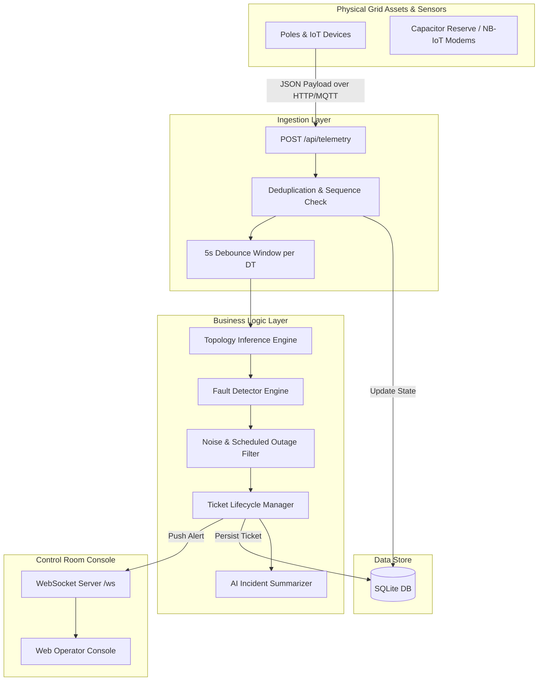

# 📐 Technical Architecture — KSPDB Fault Detection System

This document explains the system design, data flow, telemetry ingestion pipeline, storage model, fault localization algorithm, noise filtering strategies, API specifications, operator UI reasoning, and AI integration.

---

## 1. System Overview & Data Flow Diagram



---

## 2. Telemetry Sourcing & Ingestion Design

### Ingestion Throughput & Reliability
- **Steady State:** ~39 msg/sec steady telemetry from 35,000 devices reporting 15-minute heartbeats.
- **Burst Tolerance:** Tested up to 5,000 bursts/10 sec during large feeder outages.
- **Deduplication:** Performed using `device_id` and monotonic `seq`. If `seq <= last_seq` for a device, the packet is logged as duplicate and ignored.
- **Clock Skew Handling:** Up to ±90s device clock skew is tolerated by prioritizing monotonic `seq` per device for ordering rather than relying on global `ts`.
- **Firmware 1.2.x Special Case (~8% fleet):** Older devices do not issue `power_lost` upon power failure. The ingestion layer tracks missed 15-minute heartbeats. If 2 consecutive heartbeats are missed, the device is flagged as potentially dark.

---

## 3. Storage & Internal Data Model

SQLite was selected for its zero-configuration deployment, transactional guarantees (WAL mode enabled), and fast synchronous in-memory query performance (<2ms query latency for DT graph lookup).

### Key Entity Relationships
- `substations` 1 ── N `feeders`
- `feeders` 1 ── N `transformers` (DTs)
- `transformers` 1 ── N `poles`
- `poles` 1 ── 1 `pole_state`
- `tickets` 1 ── N `ticket_poles`

---

## 4. Fault Localization Algorithm

### A. Graph Traversal & Live/Dark Boundaries
Low-voltage electricity distribution is strictly **radial (tree topology)** with no loops.
- **The Observable Signature:** When a span breaks, every pole downstream of the break loses power; upstream poles remain live.
- **Boundary Detection:** The algorithm traverses the tree starting from the DT root. It scans for edges where the **parent node is live (`energized = 1`)** and the **child node is dark (`energized = 0`)**.
- **Grouping:** All dark poles reachable downstream from the boundary child are aggregated into a **single incident ticket**.

```
    DT (Live) ── P-1 (Live) ── P-2 (Live) ── ╳ ── P-3 (Dark) ── P-4 (Dark)
                                             │
                                       Fault Boundary (Span P-2 → P-3)
```

### B. Strategy for Missing Topology (60% of DTs)
For 60% of distribution transformers, `seq_on_line` and `parent_pole_id` are null.

**Our Approach: Geometric Nearest-Neighbor Chain from DT Coordinates**
1. Locate the DT's surveyed GPS coordinates (`lat`, `lon`).
2. Identify the closest unvisited pole to the DT — set as root (Pole #1).
3. Sequentially connect each pole to its nearest unvisited neighbor.
4. **Branch Detection:** If the distance to the nearest unvisited pole exceeds 1.8× the median pole spacing, the algorithm searches earlier visited poles for a closer parent, establishing a spur branch.
5. **Confidence Adjustment:** Tickets on inferred topologies automatically carry lower confidence scores (~50–65%) and display a visible warning in the operator console: `⚠️ Inferred from GPS`.

### C. Complexity & Known Failure Modes
- **Time Complexity:** $O(V + E)$ where $V$ is poles under a DT and $E$ is spans.
- **Failure Cases:**
  - **U-shaped roads or dense multi-tier branches:** Geometric chaining may misidentify branch connection points by ±1 pole span.
  - **Un-instrumented poles at boundary:** If a pole without a telemetry device sits on the boundary, the algorithm reports the range between nearest reporting live and dark devices.

---

## 5. Noise Handling & False Positive Story

| Noise Source | Mitigation Logic |
| :--- | :--- |
| **Dead Modem / Broken Sensor** | If a single pole reports dark but all its child poles are live, this is physically impossible as a line fault. The pole is flagged `is_sensor_dead = 1` and **no ticket is issued**. |
| **Scheduled Outage / Load Shedding** | Before issuing a ticket, the system queries `scheduled_outages`. If a matching feeder/DT outage is active (with a 40-minute overrun buffer), ticket creation is suppressed. |
| **Transient Spikes & Bursts** | Telemetry triggers a 5-second debounce window per DT before running graph analysis, ensuring bursty arrival of dark packets is grouped together cleanly. |
| **Tampered / Premature Resolution** | Manual attempts to transition a ticket to `resolved` are validated against `pole_state`. If any pole remains dark, the API rejects the transition with HTTP 400. |

---

## 6. API Specifications

| Method | Endpoint | Purpose |
| :--- | :--- | :--- |
| `POST` | `/api/telemetry` | Ingest single or batch telemetry JSON payloads |
| `GET` | `/api/tickets` | List tickets with filters (`status`, `severity`, `dtId`, `feederId`) |
| `GET` | `/api/tickets/:id` | Get ticket detail with full list of affected poles |
| `PATCH` | `/api/tickets/:id` | Transition ticket status (`acknowledged`, `crew_assigned`, `resolved`, `closed`) |
| `GET` | `/api/network/stats` | System overview statistics (live/dark counts, active tickets) |
| `GET` | `/api/network/poles` | Get pole registry with current telemetry state |
| `GET` | `/api/network/topology/:dtId` | Retrieve tree topology graph (known or inferred) |
| `POST` | `/api/simulator/fault` | Inject simulated fault (span, DT, or feeder) |
| `POST` | `/api/simulator/repair` | Repair simulated fault and trigger auto-verification |
| `POST` | `/api/simulator/reset` | Reset network simulation state |
| `WS` | `/ws` | Real-time WebSocket feed for live updates |

---

## 7. Operator Console UI Rationale

Designed specifically for a control room operator working at 2 a.m.:
- **Information Hierarchy:** High-contrast dark theme minimizes eye fatigue. Active incidents sorted by severity dominate the left sidebar.
- **Geographic & Topological Context:** Selecting an incident automatically focuses the Leaflet map onto the fault location, highlights the broken span in dashed amber/yellow, and colors downstream affected poles in red.
- **Honest Uncertainty:** Inferred topologies explicitly display `⚠️ Inferred from GPS` with confidence bars so operators know when field verification is required.
- **Minimal Cognitive Overhead:** Irrelevant technical telemetry details (capacitance, rssi) are hidden inside expandable popups; actionable location data (PIN code, pole IDs, coordinates) is front and center.

---

## 8. AI Feature Justification

### Role of AI: Plain-English Incident Summarization
- **Where AI Belongs:** Translating structured graph alerts into clear, human-readable operational summaries for control room staff.
- **Where AI Does NOT Belong:** Fault localization itself. Deterministic graph traversal is instant, 100% explainable, and free. Using an LLM for graph traversal introduces latency, cost, and hallucination risk.
- **Fallback Guarantee:** If the OpenAI API key is unconfigured or rate-limited, the system seamlessly uses deterministic template-based summarization with zero degradation to core fault detection.
- **Cost:** ~$0.002 per incident summary using GPT-4o-mini.
