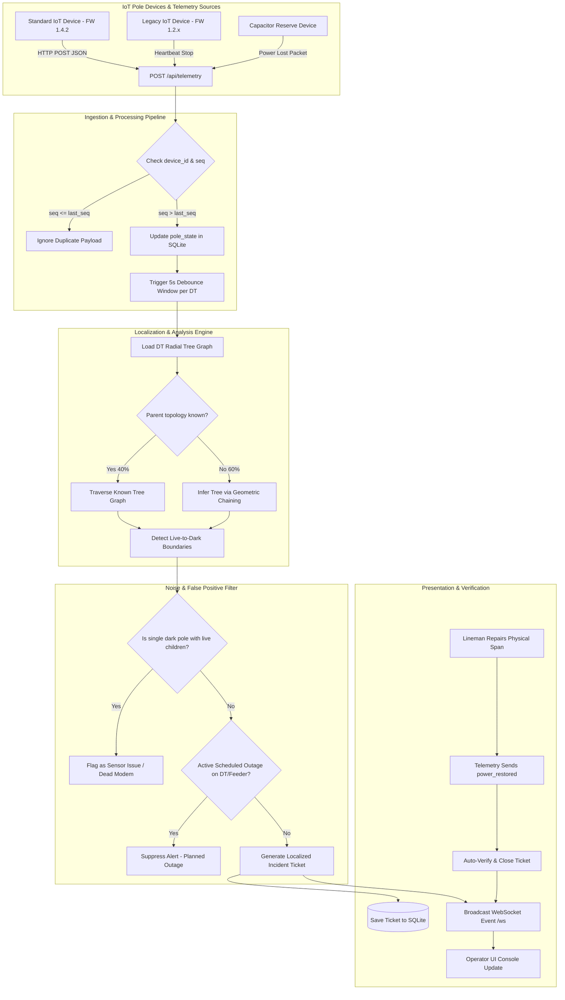
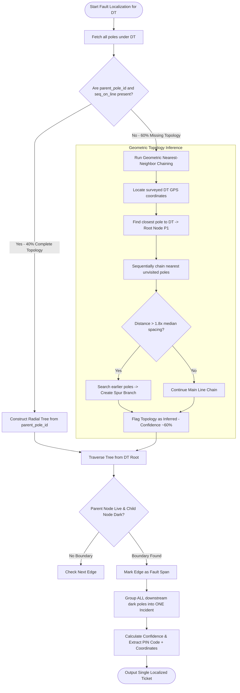
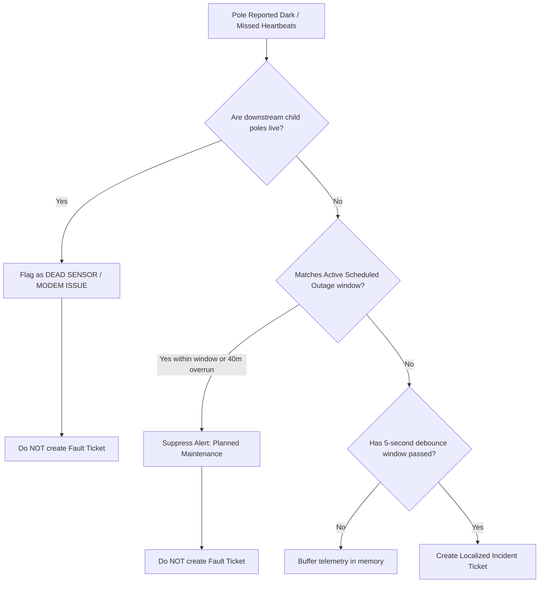
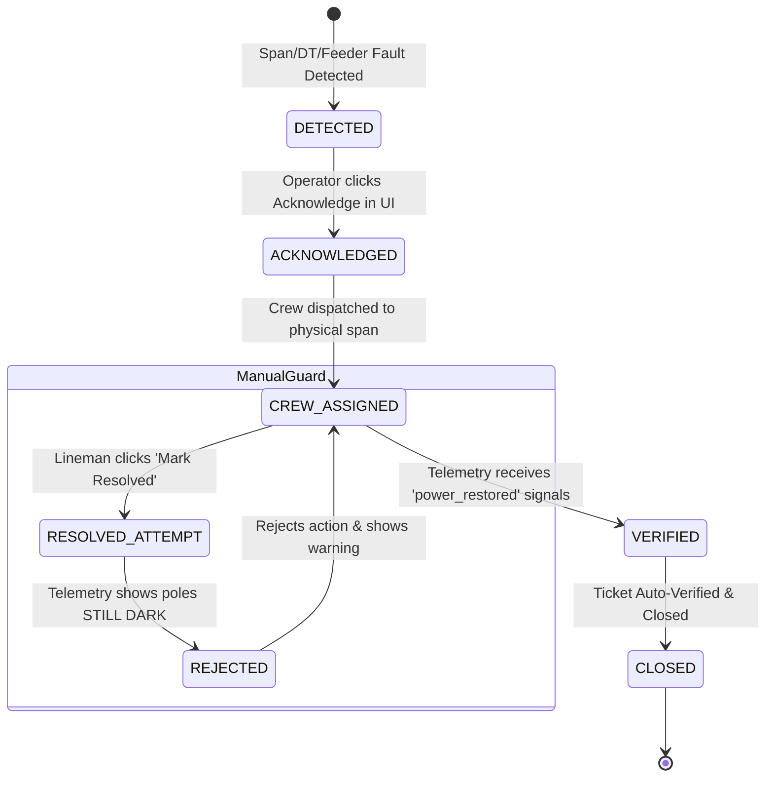

# 📊 KSPDB System Flowcharts & Sequence Diagrams

This document contains visual Mermaid flowcharts and state diagrams for the **KSPDB Power Grid Fault Detection & Localization System**, covering the end-to-end telemetry architecture, graph topology inference, fault localization, noise filtering decision tree, and ticket lifecycle.

---

## 1. End-to-End Telemetry Architecture & Ingestion Flowchart

---

## 2. Fault Localization & Topology Inference Flowchart (Handling Missing 60% Topology)

---

## 3. Noise Filtering & False-Positive Decision Tree

---

## 4. Ticket Lifecycle & Telemetry-Verified Closure State Machine

